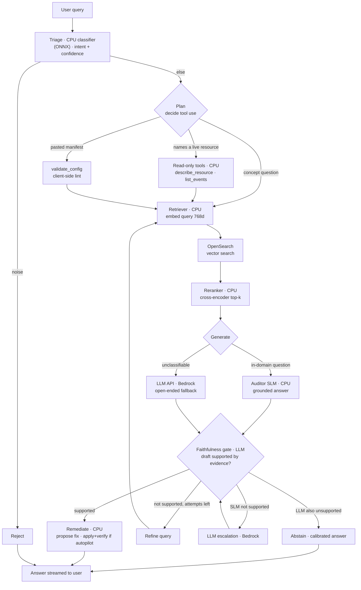
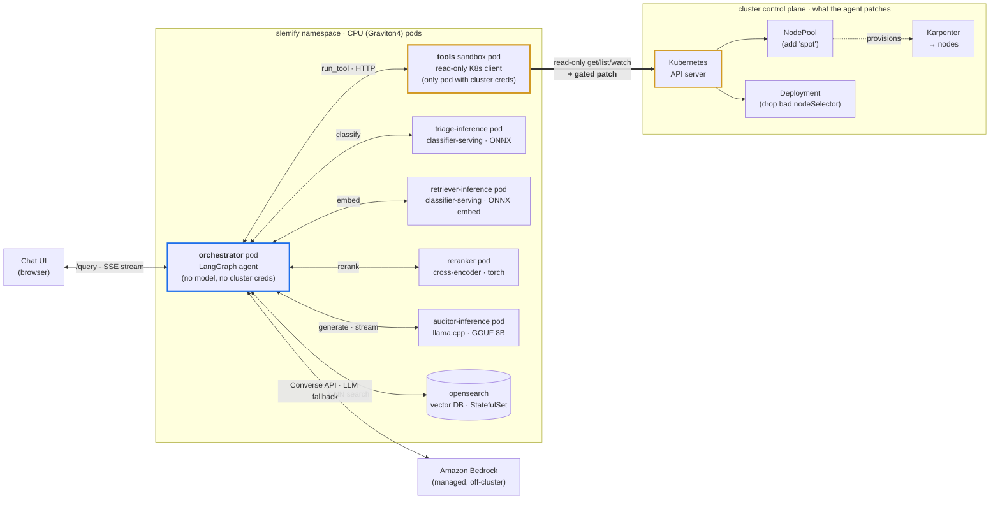
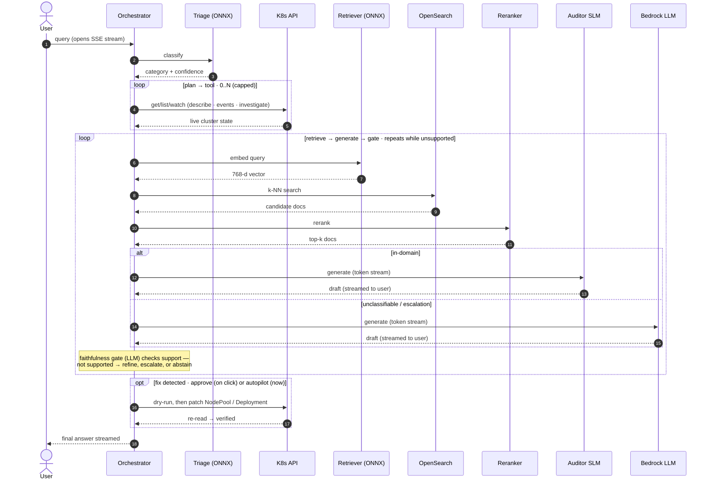

# K8s Autoscaling Expert Demo

A CPU-first **agent** that audits Kubernetes autoscaling configurations. It
triages a question, optionally gathers live evidence from the cluster with
read-only tools, grounds itself in documentation via RAG, drafts an answer with
a stock SLM served on CPU, checks that draft against the evidence with an LLM
faithfulness gate, and escalates to a large LLM only when the draft isn't
supported (and abstains honestly if even that isn't).

The point of the demo is **right tool for the right task**: the high-frequency,
narrow steps (classify, retrieve, rank, generate a domain answer) run on small
models on CPUs; a large LLM checks each answer and handles the open-ended tail.
No GPUs serve traffic.

## Architecture

The orchestration is a [LangGraph](https://langchain-ai.github.io/langgraph/)
state graph. Each node runs a CPU model (or Bedrock for the open-ended fallback)
and streams its progress to the chat UI, so the audience watches every step and
its latency live.



Two things make this an agent rather than a fixed pipeline: the **plan → tool**
loop lets it gather live evidence before answering, and the **gate → refine /
escalate / abstain** loop lets an LLM judge whether the draft is supported by the
evidence and retry, escalate, or abstain when it isn't. The plan loop runs on
CPU; the gate is one LLM call per answer.

## Components

| Component | Runtime | Instance | Role | Custom-trained? |
|-----------|---------|----------|------|-----------------|
| Chat UI | Static web app | Any | Live step log + markdown answers | — |
| Orchestrator | Python FastAPI + LangGraph | CPU pod | The agent graph: triage → plan/tools → retrieve → generate → critic | No — plain code |
| Triage classifier | Slemify classifier-serving (ONNX) | c8g (Graviton4 CPU) | Intent classification + confidence | Yes (classification head) |
| Read-only tools | Kubernetes Python client | tools sandbox pod | `describe_resource`, `list_events`, `investigate_cluster`, `validate_config` — gather live evidence | No — code |
| Retriever | Slemify retriever (`task: embedding`), ONNX | c8g (Graviton4 CPU) | Domain-tuned query/doc embeddings, 768d | **Yes** (fine-tuned encoder) |
| Reranker | sentence-transformers cross-encoder | c8g (Graviton4 CPU) | Re-ranks candidates to the best few | No — stock |
| OpenSearch | OpenSearch k-NN | CPU pod | Vector search over 3900+ doc chunks | — |
| Auditor SLM | llama.cpp | c8g (Graviton4 CPU) | Structured config analysis, streamed | No — stock 8B (Slemify convert+quantize), grounded by RAG |
| Faithfulness gate | Bedrock LLM | Managed | Judges whether the draft is supported by the evidence; drives accept/retry/escalate/abstain | No — LLM judge |
| LLM API | Bedrock | Managed | Open-ended fallback / escalation | No — general model |

Routing (which tool to use) and argument extraction (the resource name) are
deliberately **plain code, not models** — they are control-loop glue, and a few
rules do the job. The faithfulness gate is the opposite choice: catching a
confidently-wrong domain answer needs judgement, so it's an LLM call, not a
heuristic. See "Right tool for the right task" below.

## Pods & How They Interact

Every model runs in its own pod; the orchestrator holds no model and is a thin
coordinator that calls each one over HTTP. The two ONNX models (triage and
retriever) run the **same** `classifier-serving` image as separate Deployments,
differentiated by `PROJECT`/`TASK`. The demo pods land on CPU (Graviton4)
nodes; OpenSearch runs as a StatefulSet.

The key thing to notice: **only the tools sandbox pod talks to the Kubernetes
API.** It is the one component with cluster credentials — it runs the read-only
tools (`get`/`list`/`watch`) and, when apply is enabled, the gated writes
(`patch` a NodePool or Deployment). The orchestrator decides *which* tool and
arguments (credential-free parsing) and calls the sandbox over HTTP; it mounts
no ServiceAccount token. The model pods only serve inference and never touch the
API; the reranker also runs with `automountServiceAccountToken: false`. A
NetworkPolicy restricts the sandbox so only the orchestrator can reach it.



The thick edge from the tools sandbox pod to the API server is the only write
path in the system, and it stays bounded: gated by `ALLOW_APPLY`, the opt-in
write RBAC, and the whitelisted, dry-run-first remediations described under
"Remediation".

That view is the **topology** — who calls whom. A single query is not one pass
through it: the orchestrator coordinates these pods back and forth and re-runs
whole stretches. It may hit the read-only tools several times while planning, and
if the faithfulness gate finds the draft unsupported it refines the query and runs the
retrieve → rerank → generate → gate loop again before answering. The sequence
for one query:



## Read-Only Tools (gathering live evidence)

When a question names a specific cluster object or describes a runtime symptom
("why isn't NodePool `default` launching nodes?"), the agent gathers live
evidence before answering, instead of reasoning from documentation alone:

| Tool | What it does | Cluster access |
|------|--------------|----------------|
| `describe_resource` | Fetches one object (NodePool, EC2NodeClass, HPA, ScaledObject, PDB, Deployment, Pod, Node) and returns a trimmed view | read (get) |
| `list_events` | Recent events for that object or namespace | read (list) |
| `validate_config` | Client-side structural + deprecated-apiVersion lint of a pasted manifest | none (local) |

The tool output is folded into the auditor's context, so the answer is grounded
in the cluster's real state, not just the docs.

**Safety — everything is read-only:**
- Tools call the Kubernetes API through the Python client with structured,
  validated arguments — never a shelled-out `kubectl` with interpolated user
  text, so there is no command-injection surface.
- The tools sandbox pod's RBAC is a ClusterRole with **only** `get`/`list`/`watch` —
  no `create`/`update`/`patch`/`delete`. The agent can read the cluster but can
  never change it. The orchestrator itself holds no cluster RBAC.
- Resource names and namespaces (untrusted, pulled from the query) are validated
  against the Kubernetes name regex before any API call.
- `validate_config` makes no API call at all (server-side dry-run would need
  write permission), so it works even with tools disabled.

If the tools sandbox is unreachable or has no cluster credentials, tools degrade
gracefully and the agent answers from documentation — the demo still runs.

## Self-Correction (the faithfulness gate)

After the auditor drafts an answer, a **faithfulness gate** decides whether that
draft is supported by the evidence the agent gathered (retrieved docs + tool
output). The gate is an LLM call (Bedrock, `GATE_MODEL`, defaulting to the same
model as escalation): catching a *confidently wrong* domain answer — one that
reuses the right terms but states a field, default, or behavior the docs don't
support — needs judgement a lexical heuristic can't provide. A small model proved
too lenient at this, so the gate defaults to the capable model.

On a flagged draft the agent does one of four things: **refine** the query and
regenerate (bounded retry); gather **live evidence** if the claim is about runtime
state it hasn't checked; **escalate** to the LLM with everything it gathered; or,
if even the escalated LLM answer fails the gate, **abstain** — emit a calibrated
answer that states only what the evidence supports and says plainly what it could
not confirm. That abstain step is the "never confidently wrong" backstop: the top
of the ladder is not exempt from the gate. A replaced draft is updated in the UI,
so the audience sees the agent catch and correct itself.

## Remediation (read-only → approve → autopilot)

Diagnosing is the default; the agent can also **fix** a problem it diagnosed.
Remediation is layered so you can demo three escalating levels of autonomy with
the same agent, and the safety boundary is enforced server-side — the UI toggle
is just UX, not the gate.

| Mode | How it's enabled | What the agent does |
|------|------------------|---------------------|
| **Read-only** (default) | `ALLOW_APPLY` unset; no write RBAC | Diagnoses only. Never proposes a structured apply. |
| **Approve** | `ALLOW_APPLY=true` + `kubectl apply -f k8s-rbac-apply.yaml` | Diagnoses, then surfaces a **proposed fix** with an *Apply this fix* button and a copy-pasteable manual command. Nothing changes until you click. |
| **Autopilot** | Approve mode **+** the per-request autopilot toggle | Diagnoses, announces what it's about to do, applies the fix, and re-reads to verify — all in one turn. |

When a fix is detected, the chat narrates the mode: in **approve** mode the agent
says it won't change anything and offers the button or the manual command; in
**autopilot** it says it's applying the fix now, then shows the apply + verify
steps and the confirmed result.

**Safety — apply is deliberately narrow:**
- **Disabled by default.** Without `ALLOW_APPLY=true` *and* the opt-in write
  ClusterRole (`k8s-rbac-apply.yaml`, `get`/`patch`/`update` on NodePools only),
  the agent physically cannot mutate the cluster — the default RBAC is
  read-only `get`/`list`/`watch`.
- **Whitelisted, structured patches only.** The agent never executes free-form
  changes. Each remediation is a coded `(apply, verify)` pair that edits a single
  field. Two are wired up today: add `spot` to one NodePool's capacity-type, and
  remove an impossible `nodeSelector` key (one no node satisfies) from a named
  Deployment so its pods can schedule.
- **Bounded blast radius.** A remediation is only offered for a resource the
  user **explicitly named** and that genuinely has the problem — never a blanket
  change across the cluster. Intentionally on-demand NodePools are left alone
  unless you name them.
- **Dry-run then verify.** The apply server-side dry-runs first, then patches,
  then re-reads the resource to confirm the change took effect.
- **Human in the loop by default.** Autopilot is opt-in per request; absent it,
  every fix waits for an explicit click.

## Right Tool for the Right Task

The demo's guiding principle is matching the tool to the task, not training a
model for every step:

- **Fine-tune where domain quality genuinely improves.** The **retriever**
  (embedding) is fine-tuned on the K8s corpus — that's where a custom model
  measurably beats a generic one (see the retriever numbers below).
- **Serve a stock model where the base is already capable.** The **auditor**
  (generation) is served stock and grounded by RAG. We tested fine-tuning it and
  it made answers *worse*: the base model already reasons, what it lacked was the
  facts, and RAG supplies those. (We also tested quantizing it below q8_0; that
  lost calibration — see the repo training deep dive.)
- **Train a cheap head for a learned closed-set decision.** **Triage** is a
  logistic head on a frozen encoder — CPU-trained in seconds and deterministic.
  Its category rejects clear noise up front and sends in-domain questions to the
  auditor SLM; only input it genuinely can't classify falls straight through to
  the LLM.
- **Use a stock model where it already wins.** The **reranker** is an
  off-the-shelf cross-encoder; we measured that *fine-tuning* one on synthetic
  data made it worse (see "Why Keep the Reranker").
- **Use plain code for glue.** Tool routing, argument extraction, and the
  guardrail are rules — control-loop decisions that don't need ML.
- **Use a capable LLM to check the cheap model.** The faithfulness gate is an LLM
  judging whether the SLM draft is supported by the evidence — the one judgement
  a heuristic couldn't make reliably.
- **Use a large LLM for the open-ended tail.** Low-confidence or ambiguous
  questions escalate to Bedrock.

So the agent runs on **two custom-trained models** (retriever, triage), a stock
SLM auditor, a stock reranker, plain code for the control loop, and a capable LLM
for the faithfulness gate and the open-ended fallback — not a fine-tuned model
per step.

## Knowledge Base

~3900 chunks indexed from:
- Karpenter v1 docs (API reference, concepts, troubleshooting)
- KEDA v2.19 docs (ScaledObject, triggers, authentication)
- AWS EKS Best Practices (autoscaling section)
- 17 AWS blog posts (Karpenter v1.0, Spot consolidation, Graviton migration, KEDA + Prometheus, etc.)

Embedding model: the Slemify-trained retriever (`task: embedding`, 768 dimensions),
served in-cluster on CPU. It exposes a TEI-compatible `/embed` endpoint, so no
external API call is needed for embeddings. The same encoder embeds documents at
index time and queries at search time.

## Why a Domain-Tuned Retriever

The demo's RAG retrieval runs on the Slemify-trained retriever rather than a
stock embedding model. We measured the difference before switching, on the
actual demo corpus (4,287 indexed chunks from Karpenter, KEDA, and EKS docs),
using 60 queries generated from sampled chunks:

| Encoder | recall@1 | recall@5 | recall@10 | MRR | embed ms/query |
|---------|---------:|---------:|----------:|----:|---------------:|
| Stock (general-purpose encoder) | 0.117 | 0.183 | 0.217 | 0.146 | 65.3 |
| Slemify-tuned retriever | 0.250 | 0.383 | 0.433 | 0.303 | 12.3 |

The domain-tuned retriever roughly **doubles retrieval quality** (recall and MRR)
and is **~5x faster per query** (the ONNX serving stack vs a torch-based stock
encoder). Absolute recall looks low for both because the corpus has heavy
duplication and we score a single gold chunk per query, but the relative gap is
the signal: better recall means the auditor SLM sees more relevant docs, which
directly improves answer quality. This is the same encoder you would train with
`slemify` for `task: embedding`, so the demo doubles as a worked example of when
fine-tuning a retriever pays off (a narrow, domain-specific corpus).

## Why Keep the Reranker

After vector search returns candidates, a stock general-purpose cross-encoder
(CPU) re-scores them and the orchestrator keeps only the
best ones for the SLM. A cross-encoder reads the query and a document *together*,
so it judges relevance more sharply than the retriever, which embeds them
separately — but it costs ~0.6s per query, so it has to earn that.

We tested it the same way: 100 Bedrock-generated queries over the corpus,
identical 6-candidate pool, reranker OFF (vector order) vs ON (re-scored). Two
random seeds:

| Metric | Reranker OFF | Reranker ON |
|--------|-------------:|------------:|
| recall@2 | 0.33–0.36 | **0.43–0.48** |
| recall@5 | 0.48–0.51 | 0.49–0.52 |
| MRR | 0.33–0.36 | **0.39–0.44** |

The reranker improves **recall@2 by ~10–12 points (~30% relative) and MRR by
~20%**, and it reorders the top-2 set in ~90% of queries. The win lands exactly
where the demo uses it: the high-confidence path keeps only the **top 2** docs,
and that is where the reranker promotes the genuinely-relevant chunk the
retriever ranked 3rd–6th. At top-5 the benefit nearly vanishes (you are keeping
almost the whole pool, so order barely matters). Net: the ~0.6s buys a markedly
better top-2 context, so we keep it.

Note the contrast with Slemify itself, which does **not** offer reranking as a
trainable task: *fine-tuning* a cross-encoder on synthetic data degraded it,
but a *stock* cross-encoder used only for serving clearly helps. Don't train it,
do serve it — both backed by measurement.

## Demo Prompts (Tested)

### 0. Config analysis — minValues (Auditor SLM reads a pasted manifest)

The headline demo: paste a real Karpenter manifest and ask the agent to analyze
it. The agent lints it client-side (`validate_config`), grounds itself in the
Karpenter docs via RAG, and the Auditor SLM explains it — here, what `minValues`
does and whether the config is valid (it is; `minValues: 3` requires at least 3
of the listed instance families to be available before Karpenter launches):

```
my NodePool has this requirement but pods are still pending:

apiVersion: karpenter.sh/v1
kind: NodePool
metadata:
  name: default
spec:
  template:
    spec:
      requirements:
        - key: karpenter.k8s.aws/instance-family
          operator: In
          values: ["c5", "c6i", "c7g", "m5", "m6i", "m7g"]
          minValues: 3

what does minValues do and is my config correct?
```

In the step log you'll see: Triage → Plan → `validate_config` (manifest lint) →
Retriever/OpenSearch/Reranker → Auditor SLM → Critic. Live cluster tool use
(`describe_resource`/`list_events` against real objects) is demonstrated by the
remediation scenarios in §4, which name actual broken resources.

### 1. Config analysis (Auditor SLM responds)

**NodePool limits:**
```
pods are stuck in Pending but karpenter isn't launching new nodes. no errors in the karpenter logs, it just says "can't create any more capacity." we checked and our NodePool has limits set:

apiVersion: karpenter.sh/v1
kind: NodePool
metadata:
  name: default
spec:
  template:
    spec:
      requirements:
        - key: karpenter.k8s.aws/instance-category
          operator: In
          values: ["c", "m"]
        - key: karpenter.k8s.aws/instance-generation
          operator: Gt
          values: ["4"]
      nodeClassRef:
        group: karpenter.k8s.aws
        kind: EC2NodeClass
        name: default
  limits:
    cpu: "50"
    memory: 200Gi
  disruption:
    consolidationPolicy: WhenEmpty
    consolidateAfter: 60s

kubectl get nodepool shows we're at 48 CPU used out of 50 limit. so karpenter won't provision more. but we have 20 pending pods. should we increase the limits?
```

**Deprecated API (ChatGPT gave wrong config):**
```
hey team, need some help with karpenter on our EKS 1.31 cluster. we're trying to get GPU nodes provisioned for our ML training workloads. i asked ChatGPT for a karpenter config and it gave me this:

apiVersion: karpenter.sh/v1alpha5
kind: Provisioner
metadata:
  name: gpu-provisioner
spec:
  requirements:
    - key: node.kubernetes.io/instance-type
      operator: In
      values: ["p3.2xlarge", "p3.8xlarge", "g4dn.xlarge", "g4dn.2xlarge"]
    - key: karpenter.sh/capacity-type
      operator: In
      values: ["on-demand"]
  limits:
    resources:
      cpu: 256
      memory: 1024Gi
      nvidia.com/gpu: 32
  provider:
    instanceProfile: KarpenterNodeInstanceProfile-ml-cluster
    subnetSelector:
      karpenter.sh/discovery: ml-cluster
    securityGroupSelector:
      karpenter.sh/discovery: ml-cluster
```

**Drift issue (AMI rollout replacing all nodes at once):**
```
we updated our EC2NodeClass to use a new AMI version (changed amiSelectorTerms from v20240703 to v20240807). karpenter is now showing nodes as "Drifted" but it's replacing them all at once instead of doing a rolling replacement. we have 15 nodes and they're all getting replaced simultaneously, causing downtime.

apiVersion: karpenter.k8s.aws/v1
kind: EC2NodeClass
metadata:
  name: default
spec:
  amiSelectorTerms:
    - alias: al2023@v20240807
  role: KarpenterNodeRole
  subnetSelectorTerms:
    - tags:
        karpenter.sh/discovery: prod-cluster
  securityGroupSelectorTerms:
    - tags:
        karpenter.sh/discovery: prod-cluster

our NodePool disruption budget is set to nodes: "50%" but it doesn't seem to be limiting the drift replacements. is drift not subject to disruption budgets?
```

### 2. Escalation to the LLM

The LLM is the open-ended tail, not the default. A question reaches Bedrock two
ways: triage can't classify it into the domain at all, or the auditor SLM drafts
an answer the faithfulness gate finds unsupported by the retrieved docs (after a refine retry).
The second path is the common one. To see it, ask an in-domain question the
corpus only thinly covers: the auditor draft states something the retrieved docs
don't support, the faithfulness gate flags it, the agent refines and retries, and
on a second miss escalates to Bedrock with everything it gathered (and if the LLM
answer also isn't supported, it abstains with a calibrated reply).

### 3. Noise (rejected immediately)

```
what is the weather like today in Seattle?
```

Vague, non-actionable messages are treated as noise too (so they don't waste an
SLM/LLM turn):

```
I forwarded this from my manager, can you take a look?
```

### 4. Remediation (approve / autopilot)

These need apply enabled (`ALLOW_APPLY=true` + `kubectl apply -f k8s-rbac-apply.yaml`)
and a cluster with the matching broken resources. The agent diagnoses, then
either proposes the fix (autopilot off) or applies and verifies it (autopilot on).

**Spot cost — a structured fix the agent can apply** (names the NodePool, so the
remediation is bounded to it):

```
NodePool `demo-spot-misconfigured` is only using expensive on-demand instances. Why, and how do I fix it to use Spot?
```

With autopilot **off** you get a proposed fix plus an *Apply this fix* button and
the manual command; with autopilot **on** the agent patches the NodePool's
capacity-type and re-reads it to confirm Spot is now allowed.

**Pending pods — a structured fix the agent can apply** (names the Deployment, so
the fix is bounded to it; the agent removes the impossible `nodeSelector` key no
node satisfies). Note this one has a real side effect: once the pods can
schedule, Karpenter may launch a node, so it costs money in a way the Spot fix
does not.

```
All pods for the `payments-api` Deployment in namespace `slemify` are stuck in Pending. Why, and how do I fix it?
```

With autopilot **off** you get the proposed fix plus the *Apply this fix* button
and manual command; with autopilot **on** the agent patches out the bad
`nodeSelector` key and re-reads the Deployment to confirm the pods can schedule.

### Resetting the scenarios

Once the agent fixes a problem the resource is healthy, so re-break it before
the next run. The scenario manifests live in `scenarios/` and a helper script
resets both:

```bash
./scripts/reset-demo.sh          # re-break both scenarios (also the initial setup)
./scripts/reset-demo.sh --clean  # remove the demo resources entirely
```

Reset re-applies the on-demand-only NodePool (dropping any `spot` the agent
added) and recreates the `payments-api` Deployment so all replicas come back
freshly Pending. Run `--clean` when you're done so the pending-pods node
consolidates away.

## Setup (one-time)

```bash
# Full setup: OpenSearch, knowledge base, orchestrator image, Pod Identity
# Requires an arm64 build host for the container image
ARM64_BUILD_HOST=my-graviton-host ./scripts/setup-demo.sh

# Or if running on an arm64 machine with Docker:
./scripts/setup-demo.sh
```

The setup script:
1. Verifies the SLM models and the retriever (`task: embedding`) are deployed
2. Deploys OpenSearch (if not already running)
3. Builds and pushes the orchestrator + reranker images (multi-arch)
4. Deploys the reranker and orchestrator pods (Pod Identity for Bedrock LLM fallback)
5. Indexes the knowledge base (~3900 chunks from Karpenter, KEDA, EKS docs + blogs) using the Slemify-trained retriever
6. Waits for everything to be ready

## Running Locally

```bash
# Prerequisites: models deployed via slemify deploy
# Port-forwards:
kubectl port-forward -n slemify svc/k8s-autoscaling-triage-inference 8081:8080
kubectl port-forward -n slemify svc/k8s-autoscaling-auditor-inference 8082:8080
kubectl port-forward -n slemify svc/opensearch-cluster-master 9200:9200
kubectl port-forward -n slemify svc/k8s-autoscaling-retriever-inference 8083:8080
kubectl port-forward -n slemify svc/k8s-autoscaling-reranker 8084:80

# Install deps
pip install fastapi uvicorn httpx opensearch-py boto3 langgraph kubernetes pyyaml

# Start server (warms up models on boot)
python3 server.py

# Open http://localhost:8000
```

> The agent uses your kubeconfig for the read-only tools when run locally
> (in-cluster it uses the read-only ServiceAccount). Set `TOOLS_ENABLED=false`
> to skip cluster access and answer from documentation only.

To demo remediation locally, start the server with apply enabled:

```bash
ALLOW_APPLY=true python3 server.py
```

This surfaces the autopilot toggle in the UI and lets the *Apply this fix*
button / autopilot patch run. Your kubeconfig must allow `patch` on NodePools
(the in-cluster path uses the opt-in `k8s-rbac-apply.yaml` ClusterRole). With
`ALLOW_APPLY` unset the agent stays strictly read-only.

## Deploying to Cluster

```bash
# One command: builds images, pushes to ECR, sets up Pod Identity, deploys
./scripts/deploy.sh

# Access via port-forward
kubectl port-forward -n slemify svc/k8s-autoscaling-orchestrator 8000:80
# Open http://localhost:8000
```

The deploy script:
1. Builds the orchestrator + reranker images and pushes to ECR
2. Creates the ServiceAccount, Deployments, and Services
3. Sets up an IAM role with Bedrock access (LLM fallback) via EKS Pod Identity
4. Waits for the rollout to complete

The deployed agent is read-only by default. To enable in-cluster remediation
(approve + autopilot), grant the opt-in write RBAC and turn apply on:

```bash
kubectl apply -f k8s-rbac-apply.yaml
kubectl set env deployment/k8s-autoscaling-orchestrator -n slemify ALLOW_APPLY=true
```

## Live Demo

```bash
# One command: reset the scenarios to broken, port-forward the orchestrator,
# open the browser, and launch the tmux log dashboard
make demo

# Show infrastructure (CPU-only nodes, pods, architecture) in a separate terminal
make infra        # or: ./scripts/show-infra.sh
```

Other handy targets:

```bash
make reset   # re-break both remediation scenarios between runs
make clean   # remove the demo scenario resources entirely
```

`make demo` is the full launcher (`reset-demo.sh` + `demo-terminal.sh`). To skip
the reset and just attach to a running demo, call `./scripts/demo-terminal.sh`
directly.

## Indexing the Knowledge Base

Indexing uses the Slemify-trained retriever, so port-forward both OpenSearch
and the retriever pod first.

```bash
# Full index (clones repos, chunks, embeds, indexes)
kubectl port-forward -n slemify svc/opensearch-cluster-master 9200:9200
kubectl port-forward -n slemify svc/k8s-autoscaling-retriever-inference 8083:8080
pip install opensearch-py httpx gitpython requests beautifulsoup4
python3 scripts/index-knowledge.py

# Add only blog posts to existing index
python3 scripts/index-knowledge.py --append --source=aws-blog

# Add only a specific source
python3 scripts/index-knowledge.py --append --source=karpenter
```

> Note: the embedding model must match at index and query time. The index
> (`k8s-autoscaling-knowledge`) is built with the Slemify-trained retriever
> (768d). Changing the embedding model requires a full reindex (the index
> mapping dimension changes), not an `--append`.

## The Story This Tells

1. **Right tool for the right task** — fine-tune where it earns it (retrieval), serve stock where the base is already capable (the generation auditor + RAG, the reranker), use plain code for glue (routing, extraction), and use a capable LLM to check answers (the faithfulness gate) and for the open-ended tail
2. CPUs handle the full AI pipeline: classification, retrieval, reranking, generation, and tool use — no GPUs serve traffic
3. An agent can route, gather live evidence, and self-correct on CPU; the LLM is one tool in the mix, not the foundation
4. RAG + live cluster state grounds the response in real evidence (reduces hallucinations)
5. A stock SLM grounded by RAG handles the domain answer on CPU; the custom training pays off in the retriever, not the generator
6. A domain-tuned retriever roughly doubles RAG retrieval quality (see "Why a Domain-Tuned Retriever")
7. Read-only tools make the agent useful on real clusters without the risk of mutating them
8. When you do want it to act, remediation is layered — read-only, approve-to-apply, then autopilot — with the write path gated, whitelisted, bounded to a named resource, and dry-run + verified
9. Kubernetes-native: Karpenter provisions nodes, KEDA scales, OpenSearch runs in-cluster — everything on Spot with consolidation
